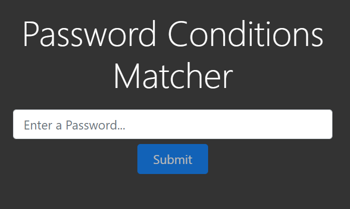
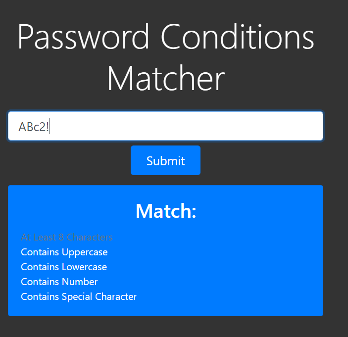
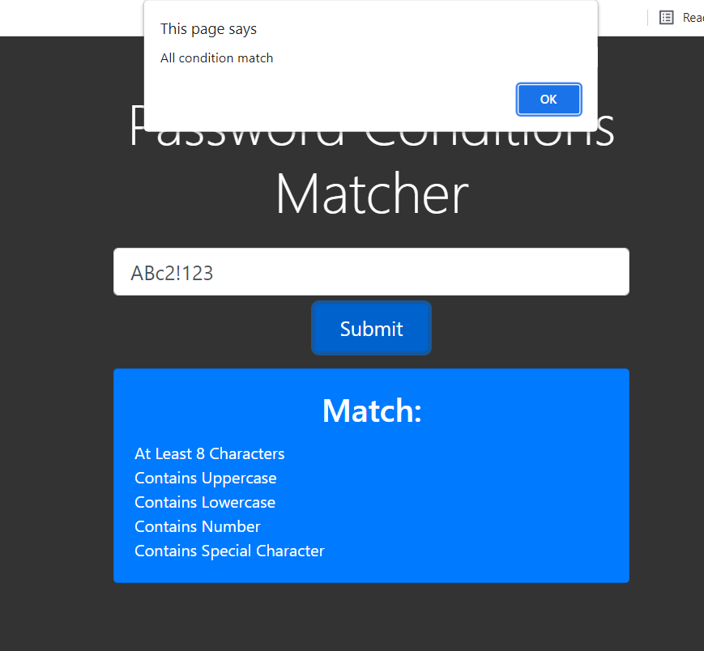
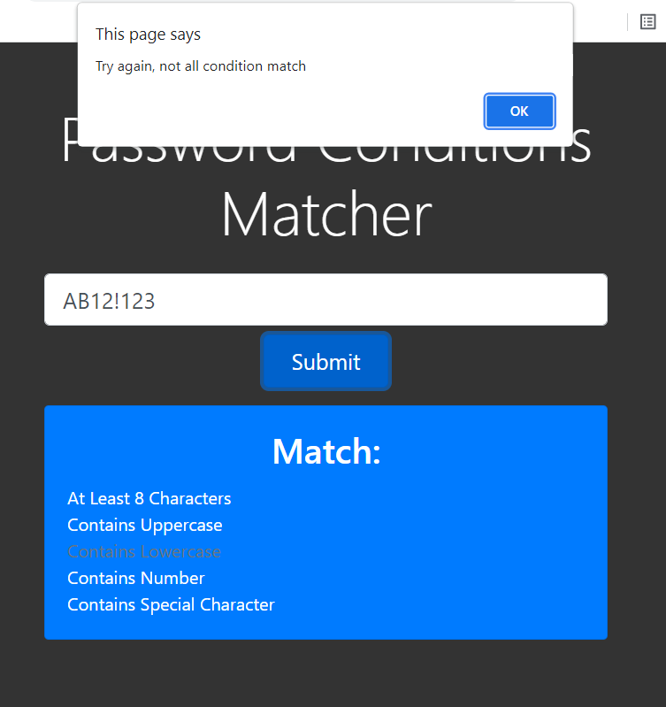

 Your project repository should include a description of what you attempted to create along with source 
 code and samples of using the program produced.

# Password Conditions Matcher - Description
This repository is mainly based on and uses javascript's addEventListener() method that listens for the input and the click events. Input event trigger when user typing into the input field and the click event is trigger when user clicks the submit button. This will check if the user's input satisfies all the requirements and display a pop-up window that notifies the user about the result.

## Startup View

## Checking for condition
The condition lights up when the input matches the condition

## Success - match all conditions

## Failure - not all conditions match

